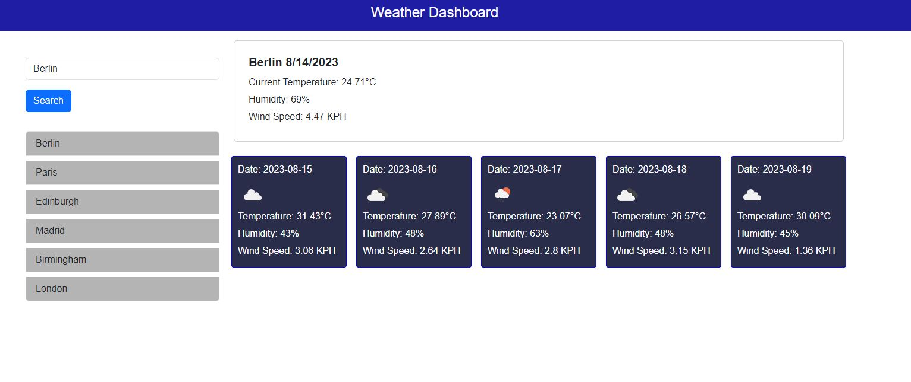

# Personal-Portfolio
## Description
This repository houses a captivating weather dashboard application that provides users with up-to-date weather information for a city of their choice. The application is designed to meet the specific requirements outlined in the acceptance criteria. Users can search for a city using a form input, and upon submitting the search, they are presented with both the current weather conditions and a 5-day forecast for that city. The dashboard is structured to display essential weather details including the city name, date, weather condition icon, temperature, humidity, and wind speed. Additionally, the application keeps track of the search history, allowing users to easily access weather information for previously searched cities.

In the process of developing the weather dashboard application, I employed a combination of HTML, CSS, and JavaScript. To fetch weather data, I integrated a third-party API, specifically the OpenWeatherMap API, which provided the necessary weather information for the user's selected city. I utilized AJAX requests to fetch both the current weather conditions and the 5-day forecast data, then processed and displayed the retrieved data on the dashboard. I also incorporated dynamic updates of HTML content using jQuery, ensuring that the information presented to users remains accurate and up-to-date.

Throughout the development of this application, I gained valuable skills that spanned multiple areas of web development. I enhanced my understanding of making API requests, processing JSON data, and integrating external data sources into web applications. I also honed my skills in DOM manipulation using jQuery to dynamically update the user interface based on the received data. Additionally, I learned how to design a user-friendly interface that effectively conveys complex weather data in a clear and concise manner. This project allowed me to practice combining different technologies to create a functional and responsive web application that fulfills user needs for accessing weather information conveniently.

- [Installation](#installation)
- [Usage](#usage)
- [Credits](#credits)
- [Link](#link)
- [License](#license)
- [Badges](#badges)

## Installation
- produce a reospiteory on GitHUB
- cloned the repository on my Desktop using the SSH Key
- Customised the content of the website by adding JavaScript
## Usage

## Credits
There were no collaborators for this project.

## Link
https://saad-054.github.io/Weather_Dashboard/

## License
MIT License

Copyright (c) 2023 Saad Siddiqui

Permission is hereby granted, free of charge, to any person obtaining a copy
of this software and associated documentation files (the "Software"), to deal
in the Software without restriction, including without limitation the rights
to use, copy, modify, merge, publish, distribute, sublicense, and/or sell
copies of the Software, and to permit persons to whom the Software is
furnished to do so, subject to the following conditions:

The above copyright notice and this permission notice shall be included in all
copies or substantial portions of the Software.

THE SOFTWARE IS PROVIDED "AS IS", WITHOUT WARRANTY OF ANY KIND, EXPRESS OR
IMPLIED, INCLUDING BUT NOT LIMITED TO THE WARRANTIES OF MERCHANTABILITY,
FITNESS FOR A PARTICULAR PURPOSE AND NONINFRINGEMENT. IN NO EVENT SHALL THE
AUTHORS OR COPYRIGHT HOLDERS BE LIABLE FOR ANY CLAIM, DAMAGES OR OTHER
LIABILITY, WHETHER IN AN ACTION OF CONTRACT, TORT OR OTHERWISE, ARISING FROM,
OUT OF OR IN CONNECTION WITH THE SOFTWARE OR THE USE OR OTHER DEALINGS IN THE
SOFTWARE.

## Badges

